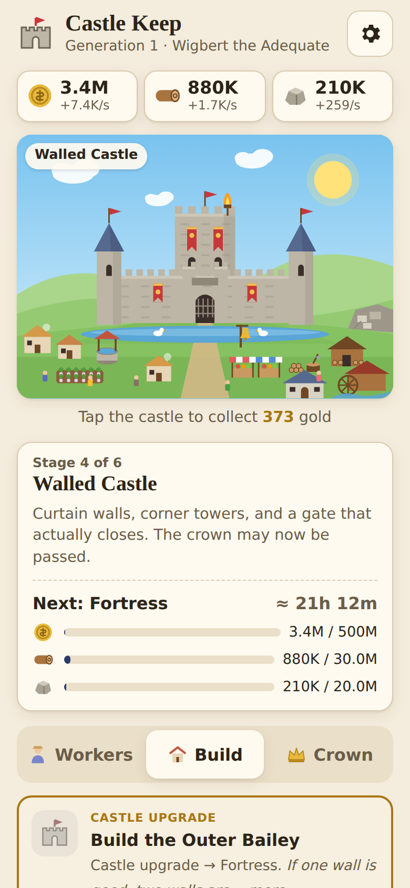

# Castle Keep



A small, cozy idle game: grow a lone wooden watchtower into a Grand Citadel.
Tap the castle for gold, hire peasants, woodcutters, masons and merchants, and
spend what they make on buildings that appear on the castle as you build them.
Six castle stages (Watchtower → Palisade → Stone Keep → Walled Castle → Fortress → Grand Citadel),
optional herald events (a traveling merchant, a napping dragon, a goose with demands),
and once you reach the Walled Castle you can **Pass the Crown** to the next generation for a
permanent Royal Legacy bonus.

Plays at **https://www.corbettscastle.com/**. It works on phones and desktops, saves automatically
in your browser, and keeps producing for up to 12 hours while you're away.

## Run it locally

It's plain HTML, CSS and JavaScript with no build step and no dependencies. Serve the folder with any
static web server and open the page:

```sh
python3 -m http.server 8000
# then open http://localhost:8000
```

(Opening `index.html` straight from disk mostly works too, but some browsers restrict saving for `file://` pages.)

## Project layout

| Path | What it is |
|---|---|
| `index.html`, `css/style.css` | The page and its styles |
| `js/game.js` | Game data and rules: resources, workers, buildings, stages, events, prestige, save format. No DOM, so Node can run it too |
| `js/art.js` | Draws the castle as SVG from the game state |
| `js/ui.js` | Page wiring: tapping, shop, dialogs, autosave, offline progress |
| `tools/simulate.js` | Headless pacing simulation (see below) |
| `tools/browser-test.js` | End-to-end checks in headless Chromium |
| `tools/make-images.js` | Regenerates `images/og-image.png` and `images/apple-touch-icon.png` from the game art |
| `CNAME` | Custom domain for GitHub Pages. Leave it alone |

## Balancing

All the numbers live in `js/game.js`. After changing them, check the pacing:

```sh
node tools/simulate.js            # time to reach each stage, with and without passing the crown
node tools/simulate.js --trace    # plus a status line at every check-in
node tools/simulate.js --cps 4 --every 2 --len 10   # a keener player
```

The simulated player taps 2×/second while playing, plays for an hour, then checks in for 5 minutes
every 3 hours during the day (09:00–23:00).

## Saves

Saves are stored in `localStorage` under `castleKeep.save` and carry a version number (`v`).
If the format ever changes, bump `SAVE_VERSION` in `js/game.js` and add a step to `MIGRATIONS`
that upgrades the old shape, so existing players keep their castles. Settings → Export gives a
text code that can be imported on another device.

## Tests

The browser tests need Playwright (`npm i -g playwright`):

```sh
NODE_PATH=$(npm root -g) node tools/browser-test.js
```
